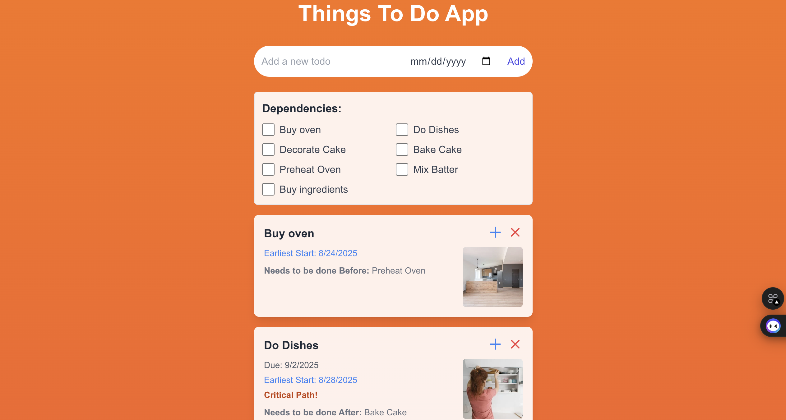
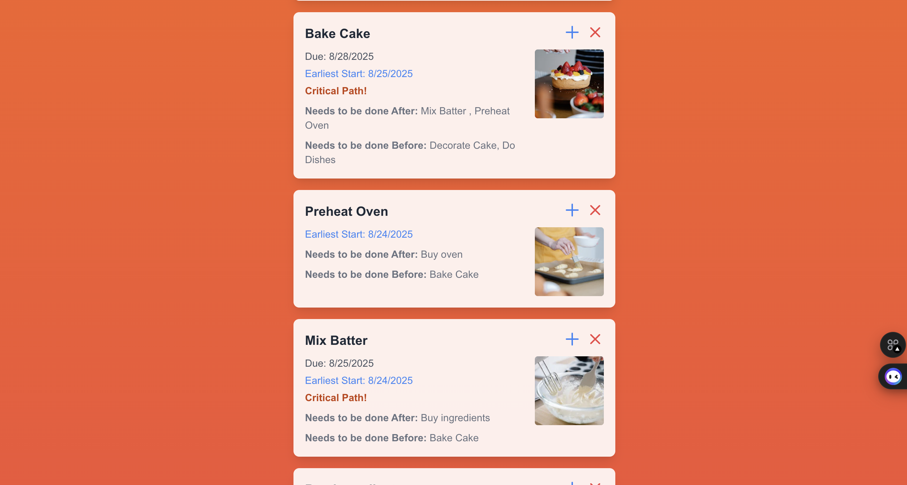
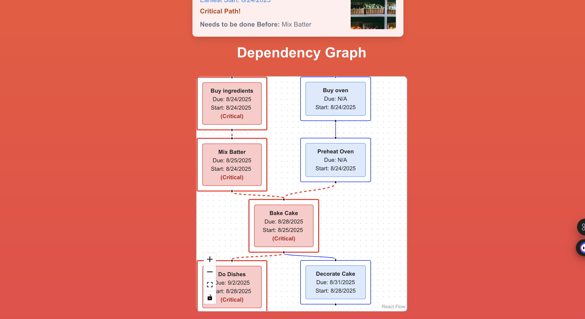

## Soma Capital Technical Assessment

This is a technical assessment as part of the interview process for Soma Capital.

> [!IMPORTANT]  
> You will need a Pexels API key to complete the technical assessment portion of the application. You can sign up for a free API key at https://www.pexels.com/api/  

To begin, clone this repository to your local machine.

## Development

This is a [NextJS](https://nextjs.org) app, with a SQLite based backend, intended to be run with the LTS version of Node.

To run the development server:

```bash
npm i
npm run dev
```

## Task:

Modify the code to add support for due dates, image previews, and task dependencies.

### Part 1: Due Dates 

When a new task is created, users should be able to set a due date.

When showing the task list is shown, it must display the due date, and if the date is past the current time, the due date should be in red.

### Part 2: Image Generation 

When a todo is created, search for and display a relevant image to visualize the task to be done. 

To do this, make a request to the [Pexels API](https://www.pexels.com/api/) using the task description as a search query. Display the returned image to the user within the appropriate todo item. While the image is being loaded, indicate a loading state.

You will need to sign up for a free Pexels API key to make the fetch request. 

### Part 3: Task Dependencies

Implement a task dependency system that allows tasks to depend on other tasks. The system must:

1. Allow tasks to have multiple dependencies
2. Prevent circular dependencies
3. Show the critical path
4. Calculate the earliest possible start date for each task based on its dependencies
5. Visualize the dependency graph

## Submission:

1. Add a new "Solution" section to this README with a description and screenshot or recording of your solution. 
2. Push your changes to a public GitHub repository.
3. Submit a link to your repository in the application form.

Thanks for your time and effort. We'll be in touch soon!

## Solution:

### Part 1: Due Dates

Amended the prisma db to have a column of due_dates and sent the date from the front end date selector to be stored and then rendered. Now, when you create a new task, you can easily set a due date. And to keep you on track, any task whose due date has passed will have its date highlighted in a clear red.

### Part 2: Image Generation

When you create a todo, the app now intelligently searches for a relevant image based on your task description. This image is then displayed right within the todo item. While the image is being fetched (it's pretty quick), you'll see a little 'Loading image...' message. A personal PEXEL_API_KEY is required.

### Part 3: Task Dependencies

Amended the db again now to included dependencies between tasks. I've added checks on both the frontend and backend to prevent you from creating circular dependencies (where Task A depends on B, and B somehow ends up depending on A). If you try to create a loop, the system will let you know with a clear message, even telling you which specific tasks are causing the cycle.
The app now calculates the earliest possible start date for each task based on its dependencies. More specifically, for a task with multiple dependencies, its earliest start date is the latest completion date of all the tasks it depends on. Additionally, it identifies the 'critical path' – a sequence of tasks whose delays would directly impact the project's overall completion. Critical tasks are visually highlighted in red on the graph.
Finally, using reactflow and @dagrejs/dagre you are able to visualize all the tasks and their dependencies. Each todo is a node, and the relationships are edges. You can click on any node, and it will highlight itself, as well as its direct dependencies, while keeping critical path relations in red.




